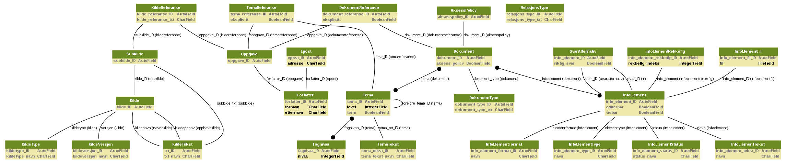

.. role:: cover

======================================
:cover:`Persistence and serialization`
======================================

.. class:: cover

    ::

        Stian Bjørn Høgås <stian.hogas@uit.no>
    
        HPC@UiT

.. raw:: pdf

   SetPageCounter 0
   Transition Dissolve 1
   PageBreak oneColumn

Persistence
----------------------------------------------------------

- Storing data
- Outlives the creating process

    - file
    - database

Serialization
----------------------------------------------------------

- Converting data into a format that can be

    - stored
    - transmitted
    - retrieved

- Python has several methods

    - pickle (subclassable)
    - cPickle (fast)

Pickling
----------------------------------------------------------

- You can pickle a variety of objects, including

    - None, True, and False
    - numbers
    - strings
    - list, dicts, tuples
    - functions, classes, instances of classes

- Pickle is first in, first out
- Unpickles in the same order 

Pickle example
----------------------------------------------------------
.. literalinclude:: pickle_example.py
    
Unpickle example
----------------------------------------------------------
.. literalinclude:: unpickle_example.py

Shelving
----------------------------------------------------------

- Persistent dictionary-like object
    
    - Shelf files

- Anything you can pickle
- Keys are strings

Shelf example
----------------------------------------------------------
.. literalinclude:: shelving_example.py

Retrieve example
----------------------------------------------------------
.. literalinclude:: unshelving_example.py

Databases
----------------------------------------------------------

- Organized collection of data
- Models relevant aspects of reality

    - availability of rooms in a hotel

- Supports processes requiring this information

    - finding vacancies in a hotel

Databases cont'ed...
----------------------------------------------------------

- Data is stored in tables
    
    - Rows
        - Related data
        - Primary key
        
    - Columns
        - Same type data
        - Column name

- Fetch any data you like

Working with databases
----------------------------------------------------------

- SQL (Structured Query Language)
- Statements
    - CREATE TABLE...
    - INSERT INTO <table> VALUES...
    - SELECT <values> FROM <table> (WHERE <condition>)...
    - DROP TABLE
    - DELETE FROM <table>

Sqlite
----------------------------------------------------------

- Lightweight database
- No database server

Sqlite create table
----------------------------------------------------------
.. literalinclude:: sqlite_create.py

Sqlite drop table
----------------------------------------------------------
.. literalinclude:: sqlite_drop.py

Sqlite insert
----------------------------------------------------------
.. literalinclude:: sqlite_insert.py

Sqlite delete
----------------------------------------------------------
.. literalinclude:: sqlite_delete.py

Sqlite select
----------------------------------------------------------
.. literalinclude:: sqlite_select.py

Advanced use
----------------------------------------------------------

- Foreign keys
- Relation types
    
    - One-to one
    - One-to-many
    - Many-to-many
    
- Views
- Join

Databases can become quite complex...
----------------------------------------------------------

