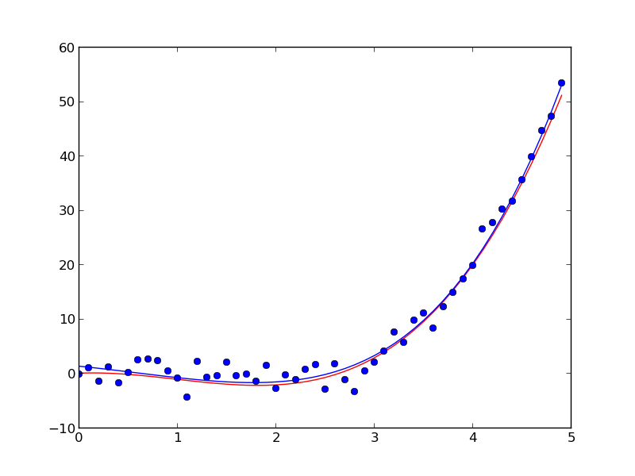
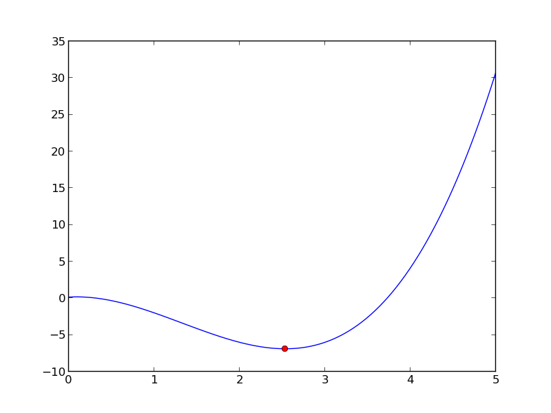
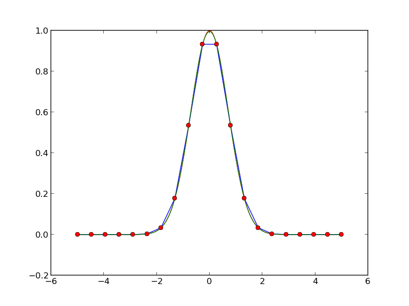
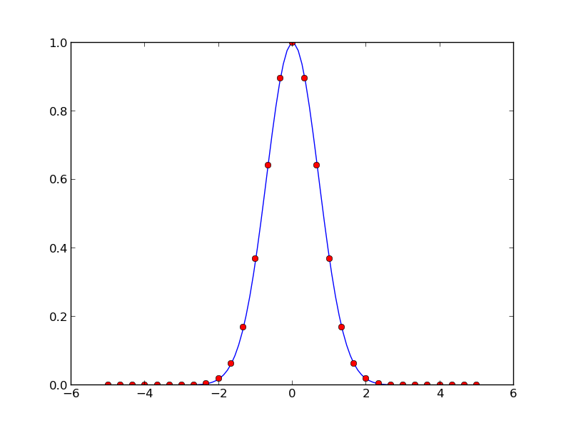

.. role:: cover

=========================================
:cover:`Numerical and Scientific Python`
=========================================

.. class:: cover

    ::

        Jonas Juselius <jonas.juselius@uit.no>
    
        HPC@UiT

.. raw:: pdf

   Transition Dissolve 1
   SetPageCounter 0
   PageBreak oneColumn

Least squares fit
----------------------------------------------------------------------
.. literalinclude:: least_square.py

Least squares fit
----------------------------------------------------------------------

Minimization
----------------------------------------------------------------------
.. literalinclude:: minimize.py

Minimization
----------------------------------------------------------------------

Interpolation
----------------------------------------------------------------------
.. literalinclude:: interpolate.py

Interpolation
----------------------------------------------------------------------

Numerical integration
----------------------------------------------------------------------
.. literalinclude:: quadrature.py

Numerical integration
----------------------------------------------------------------------

Vectorize
----------------------------------------------------------------------
.. literalinclude:: vectorize.py

Arrays
----------------------------------------------------------------------
.. literalinclude:: array.py

Random numbers
----------------------------------------------------------------------
.. literalinclude:: random_numbers.py

Opetations on arrays
----------------------------------------------------------------------
.. literalinclude:: operators.py

Masked arrays
----------------------------------------------------------------------
.. literalinclude:: mask.py

Linear algebra
----------------------------------------------------------------------
.. literalinclude:: linalg.py

