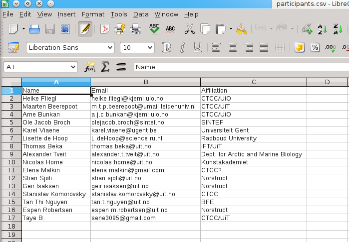

.. role:: cover

==================================
:cover:`Textparsing`
==================================

.. class:: cover

    ::

        Roy Dragseth <roy.dragseth@uit.no>
    
        HPC@UiT

.. raw:: pdf

   Transition Dissolve 1
   SetPageCounter 0
   PageBreak oneColumn

Overview
----------------------------------------------------------

* Manipulating text using builtin methods
* Regexps
* Working with spreadsheets, the csv module
* XML parsing

A word about style.
----------------------------------------------------------

Try to be as explicit as possible.  Readability counts.

Example:

  Prefer dict() over {}, ``dict(a=1, b=2)`` is better than ``{"a" = 1, "b" = 2}``

  A novice can search the documentation for dict, but not for {.

  The same goes for list, tuple and so on.

The evil side, PERL:  What the h... does ``for(<>);`` mean???

A word of advice from the trenches:  If you think you have written a really clever
piece of code, think again.  Will you be able to understand this in six months?

Manipulating text using builtin methods
----------------------------------------------------------

The str type in python has many useful builtin methods for easy matching and manipulation.

* Splitting strings into lists
* Stripping off redundant space
* Selecting text based on substrings
* Search and replace
* Checking for numbers
* Complete example
* Further info

Splitting strings into lists
----------------------------------------------------------

The split method can chunk up text to your liking.

.. code-block:: bash

      $ python
      Python 2.7.3 (default, Jul 24 2012, 10:05:38) 
      [GCC 4.7.0 20120507 (Red Hat 4.7.0-5)] on linux2
      Type "help", "copyright", "credits" or "license" for more information.
      >>> text="This is a text string in Python"
      >>> print text.split()
      ['This', 'is', 'a', 'text', 'string', 'in', 'Python']
      >>> values="one,two,three,four"
      >>> print values.split(",")
      ['one', 'two', 'three', 'four']
      >>> print values.split(",", 2)
      ['one', 'two', 'three,four']

Stripping off redundant space
----------------------------------------------------------

Often inputs contain to much whitespace, strip is your friend.

.. code-block:: bash

	$ python
	Python 2.7.3 (default, Jul 24 2012, 10:05:38) 
	[GCC 4.7.0 20120507 (Red Hat 4.7.0-5)] on linux2
	Type "help", "copyright", "credits" or "license" for more information.
	>>> text="    some text      "
	>>> print "|",text,"|"
	|     some text       |
	>>> print "|",text.strip(),"|"
	| some text |
	>>> print "|",text.lstrip(),"|"
	| some text       |
	>>> print "|",text.rstrip(),"|"
	|     some text |

Adding space is also easy

.. code-block:: bash

      >>> print text.rjust(80)
									    some text
      >>> print text.center(80)
					some text                                    

Selecting text based on substrings
----------------------------------------------------------

You can search for substrings with the find method

.. code-block:: bash

	$ python
	Python 2.7.3 (default, Jul 24 2012, 10:05:38) 
	[GCC 4.7.0 20120507 (Red Hat 4.7.0-5)] on linux2
	Type "help", "copyright", "credits" or "license" for more information.
	>>> text="This is a string"
	>>> print text.find('s')
	3
	>>> text="This is a string"
	>>> if "string" in text:
	...     print "Found it"
	... 
	Found it

Search and replace
----------------------------------------------------------

Text strings have builtins for search and replace

.. code-block:: bash

	>>> text="This is a string"
	>>> print text.replace('s','x')
	Thix ix a xtring
	>>> text[3]='x'
	Traceback (most recent call last):
	  File "<stdin>", line 1, in <module>
	TypeError: 'str' object does not support item assignment

Note that strings are immutable objects!

Checking for numbers
----------------------------------------------------------

Text strings can check if they are an integer.

.. code-block:: bash

	>>> anumber="1"
	>>> anumber.isdigit()
	True
	>>> a=int(anumber)
	>>> a
	1

Converting a non-integer will throw an exception.

Complete example
----------------------------------------------------------

Let us take a look at the participant list and display the participants with uit.no email address.

.. code-block:: rst
    :include: Python-workshop-participants.rst

The program
----------------------------------------------------------

participants.py

.. literalinclude:: participants.py

There are a couple of WTFs here: map??, string formatting.

The output
----------------------------------------------------------

.. code-block:: bash

	$ python -i participants.py Python-workshop-participants.rst 
	name=              Thomas Beka email=  thomas.beka@uit.no affiliation=             IFT/UiT
	name=          Alexander Tveit email=alexander.t.tveit@uit.no affiliation=Dept. for Arctic and Marine Biology
	name=            Nicolas Horne email=nicolas.horne@uit.no affiliation=      Kunstakademiet
	name=             Stian Sjøli email=  stian.sjoli@uit.no affiliation=           Norstruct
	name=             Geir Isaksen email= geir.isaksen@uit.no affiliation=           Norstruct
	name=     Stanislav Komorovsky email=stanislav.komorovsky@uit.no affiliation=                CTCC
	name=           Tan Thi Nguyen email= tan.t.nguyen@uit.no affiliation=                 BFE
	name=          Espen Robertsen email=espen.m.robertsen@uit.no affiliation=           Norstruct

Exercises

#. List the non-uit emails.
#. Count the number of participants based from each email domain.
#. Split the name into firstname and surname.

* Further info

The inline docs on strings is pretty extensive,  help(str) in ipython should be a good start.

Regexps
----------------------------------------------------------

For more advanced text manipulations one needs to use regexps (REGular EXPressions).

* Regexps is a language for matching text.  
* The syntax is really cryptic
* Example regexp matching dates in format yyyy-MM-dd

.. code-block:: bash

  (19|20)\d\d([- /.])(0[1-9]|1[012])\2(0[1-9]|[12][0-9]|3[01])

* Do a google search for regex cheat-sheet, print it out and tape it to the wall.

Basics
----------------------------------------------------------

http://www.regular-expressions.info/reference.html

Regexps in python.
----------------------------------------------------------

Regular Expression HowTo

http://docs.python.org/2/howto/regex.html

Python has its own regexp library, re

Search and grab
----------------------------------------------------------

Find all emails

findemails.py

.. literalinclude:: findemails.py
  
The regexp says, find the widest substring that contain @, but not space or comma. 

* () marks a pattern group that can be referenced later.
* [] denotes character classes, [a-z]= all lowercase chars.  [^ ] not, [^a-z] anything except the lowercase chars.
* . any character, + one or more matches, * zero or more matches -> .* will match any string.
* if you want to match a . (a dot) you need to quote it with backslash, \\.
* if you want to match a backslash you need to quote it with a backslash, \\\\

Note that this is not the way to match email addresses in general.  To match a RFC822 compliant email adress you need to do this 

.. code-block:: bash

  \b[A-Za-z0-9._%+-]+@[A-Za-z0-9.-]+\.[A-Za-z]{2,4}\b

(YIKES!!!)

.. code-block:: bash

	$ python  findemails.py
	heike.fliegl@kjemi.uio.no
	m.t.p.beerepoot@umail.leidenuniv.nl
	a.j.c.bunkan@kjemi.uio.no
	olejacob.broch@sintef.no
	karel.viaene@ugent.be
	.
	.

Search and replace
----------------------------------------------------------

Scramble all emails

Add "-nospam" to all emails to prevent spam-bots to get hold of published emails.

scrambleemails.py

.. literalinclude:: scrambleemails.py

* \\1 contain the part before @, \\2 contains the part after @.

Result
----------------------------------------------------------

.. code-block:: bash

    $ python scrambleemails.py

.. code-block:: rst

    List of participants
    =====================

    .. csv-table:: Workshop 2012
	:header: #, Name, E-mail address, Affiliation
	:widths: 5, 16, 30, 20

	1 , Heike Fliegl       , heike.fliegl-nospam@kjemi.uio.no           , CTCC/UiO
	2 , Maarten Beerepoot  , m.t.p.beerepoot-nospam@umail.leidenuniv.nl , CTCC/UiT
	3 , Arne Bunkan        , a.j.c.bunkan-nospam@kjemi.uio.no           , CTCC/UiO
	.
	.
	.

(OK, this might not fool even the stupidest spam-bot.)

Further info
----------------------------------------------------------

Do a google search on "python regexp" and you will find more than you ever need.

Using a regexp editor is often a good help: http://myregexp.com/

A word of caution from the Python Regexp Howto:

  Sometimes using the re module is a mistake.

In many cases the builtin string methods are easier to use and you can actually understand
what you were doing six months from now on.

Working with spreadsheets
----------------------------------------------------------

The simplest way to work with data from spreadsheets is to go via the csv format (Comma Separated Values).

The csv format is just a textfile with lines of data-entries separated by a common character. (Not neccessarily a comma.)

.. code-block:: csv

	1 , Heike Fliegl       , heike.fliegl@kjemi.uio.no           , CTCC/UiO
	2 , Maarten Beerepoot  , m.t.p.beerepoot@umail.leidenuniv.nl , CTCC/UiT
	3 , Arne Bunkan        , a.j.c.bunkan@kjemi.uio.no           , CTCC/UiO

All spreadsheet applications and databases can export to csv format. (At least the ones I've heard of.)

Basics
----------------------------------------------------------

Python has a csv library in its standard distribution.

The main parts are the writer and reader objects.

Writing csv files
----------------------------------------------------------

The writer has a method, writerow, that will take a list and create one line in the csv file.

writeparticipants2csv.py

.. literalinclude:: writeparticipants2csv.py

Reading csv files
----------------------------------------------------------

Reading csv files is equally simple.

readparticipantsfromcsv.py

.. literalinclude:: readparticipantsfromcsv.py

Or view it in a spreadsheet
----------------------------------------------------------

Working with xls files.
----------------------------------------------------------

If you have a ton of EXCEL files, you do not need to manually convert them into csv to be able
to work with them in python.

There are several module available for working directly with xls files.

http://www.python-excel.org/

is a good start.

XML data format
----------------------------------------------------------

XML (eXtended Markup Language) is a standard for transporting data between different systems.

It is widely used in many large projects, but can be very complex to deal with.

Due to its flexible format it is prohibitively hard to use regular string methods or regexps to
parse XML files.

One needs a full-blown parser, and again, python has a module for it, lxml.

XML resembles HTML, everything is embedded in tags, <tag>data</tag>.

The lxml module
----------------------------------------------------------

Extensive documentation can be found at http://lxml.de/tutorial.html

The lxml module can be used to both write and read xml files.

A special submodule, lxml.html, can be used to parse and create html.

Writing an XML file
----------------------------------------------------------

writeparticipants2xml.py

.. literalinclude:: writeparticipants2xml.py

Results in this xml output.

.. code-block:: xml

  <participants>
    <participant>
      <name>Heike Fliegl</name>
      <email>heike.fliegl@kjemi.uio.no</email>
      <affiliation>CTCC/UiO</affiliation>
    </participant>
    <participant>
      <name>Maarten Beerepoot</name>
      <email>m.t.p.beerepoot@umail.leidenuniv.nl</email>
      <affiliation>CTCC/UiT</affiliation>
    </participant>
    .
    .
    .
  </participants>

Parsing an XML file
----------------------------------------------------------

lxml provides several ways of parsing xml data, xpath, objectify, events.

Eventbased parsing.

readparticipantsfromxml.py

.. literalinclude:: readparticipantsfromxml.py

Result:

.. code-block:: bash

  participants 
    
  participant 
      
  name Heike Fliegl
  email heike.fliegl@kjemi.uio.no
  affiliation CTCC/UiO
  participant 
      
  name Maarten Beerepoot
  email m.t.p.beerepoot@umail.leidenuniv.nl
  affiliation CTCC/UiT
  participant 
      
  name Arne Bunkan
  email a.j.c.bunkan@kjemi.uio.no
  affiliation CTCC/UiO

Summary
----------------------------------------------------------

* Python have many ways to parse text.
* Use the simplest method you can, that is, prefer string builtins over regexps.
