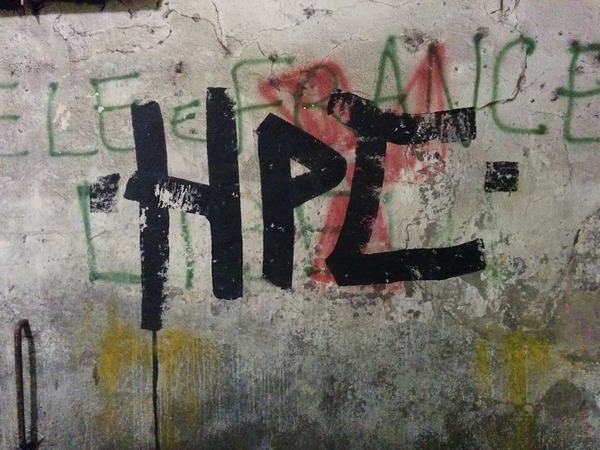

   Found in Via Notari, Pisa; (c) Roberto Di Remigio.

.. _news:

News and notifications
======================

News about planned/unplanned downtime, changes in hardware, and important
changes in software will be published on the HPC UiT twitter account
`<https://twitter.com/hpc_uit>`_ and on the login screen of stallo.
For more information on the different situations see below.

System status and activity
--------------------------

You can get a quick overview of the system load on Stallo on the
`Sigma2 hardware page <https://www.sigma2.no/hardware/status>`_.
More information on the system load, queued jobs, and node states can
be found on the `jobbrowser page <http://stallo-login2.uit.no/slurmbrowser/html/squeue.html>`_
(only visible from within the UiT network).

Planned/unplanned downtime
--------------------------

In the case of a planned downtime, a reservation will be made in the
queuing system, so new jobs, that would not finish until the downtime,
won't start. If the system goes down, running jobs will be restarted,
if possible. We apologize for any inconveniences this may cause.

